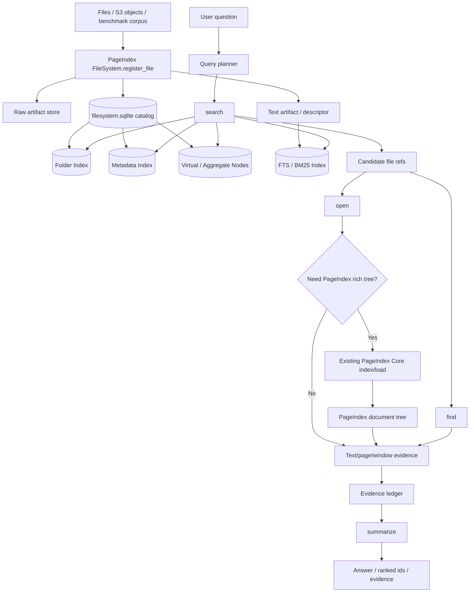

# PageIndex FileSystem Final Design

## 0. Decision

The final name is **PageIndex FileSystem**.

PageIndex FileSystem is a multi-file retrieval layer built on top of the
existing PageIndex document engine. It must not invade or replace PageIndex
Core.

```text
PageIndex Core
  single-document tree engine
  index(file) -> pageindex_doc_id
  get_document(pageindex_doc_id)
  get_document_structure(pageindex_doc_id)
  get_page_content(pageindex_doc_id, pages)

PageIndex FileSystem
  file-level catalog
  Folder implementation
  Metadata implementation
  virtual/aggregate nodes
  multi-file search/find/open/summarize tools
  lazy bridge into PageIndex Core
```

The purpose is to make PageIndex work for multi-file benchmarks and enterprise
corpora while keeping the current repository lightweight.

## 1. Goals

PageIndex FileSystem must solve:

- corpus-level retrieval across thousands to millions of files
- folder-based navigation
- metadata-based filtering, grouping, and routing
- query-time narrowing before opening document trees
- lazy PageIndex tree build for selected files
- benchmark adapters for multi-file tasks such as EnterpriseRAG-Bench, BRIGHT,
  and WixQA

It does not need to be:

- a hosted API service
- a separate repository in the first version
- a replacement for `PageIndexClient.index()`
- a full file manager UI
- an S3/object-store abstraction pretending that object keys are the logical
  folder model

## 2. Architecture



The important boundary is:

```text
PageIndex FileSystem finds the right files.
PageIndex Core reads deeply inside selected files.
```

## 3. Non-Invasive Boundary With PageIndex Core

The current PageIndex usage remains valid:

```python
client = PageIndexClient(workspace="...")
pageindex_doc_id = client.index("file.pdf")
client.get_document_structure(pageindex_doc_id)
client.get_page_content(pageindex_doc_id, "5-7")
```

PageIndex FileSystem does not add Folder or metadata parameters to
`PageIndexClient.index()`.

Instead, FileSystem stores its own mapping:

```text
file_ref
  external_id
  storage_uri
  source_path
  folder membership
  metadata
  text artifact
  shallow tree artifact
  pageindex_doc_id nullable
  pageindex_tree_status
```

When deep reading is needed, FileSystem calls the existing PageIndex Core
through the normal public surface and records the resulting `pageindex_doc_id`.

## 4. Ingestion Model

The ingestion method is not "upload and immediately build a rich document
tree." It is "register a file into the FileSystem catalog."

Recommended API shape for future implementation:

```python
file_ref = filesystem.register_file(
    storage_uri="...",
    source_path="/github/redwood/pr-56247.json",
    folder_path="/github/redwood",
    metadata={...},
    external_id="dsid_...",
    tree_policy="lazy",
)
```

Folder creation should not be mandatory before registration.

Supported modes:

```text
register_file(..., folder_path=None)
  -> place in root/default import folder

register_file(..., folder_path="/slack/eng")
  -> mkdir -p logical folder path

folder_id = create_folder("/slack/eng")
register_file(..., folder_id=folder_id)
  -> advanced explicit mode
```

Benchmark and connector importers should infer folder and metadata from source
layout and source fields. Manual folder creation should be optional.

## 5. Storage Model

First version should use local storage:

```text
workspace/
  filesystem.sqlite
  raw/
  artifacts/
    text/
    shallow_trees/
    pageindex_trees/
```

Cloud or S3 storage can be added through `storage_uri`, but the logical
FileSystem model should not depend on S3 folders. S3 has object keys, not real
folders.

Separate these concepts:

```text
storage_uri
  actual blob location
  examples: file:///..., s3://bucket/raw/abc.json

source_path
  source-system path or connector path
  examples: github/redwood/pr-56247.json

folder_path
  logical physical folder in PageIndex FileSystem
  examples: /github/redwood

virtual_path
  retrieval view generated from metadata/rules/LLM
  examples: /customer/lexihealth, /topic/audit-logging
```

## 6. Core Data Model

### files

```text
files
  file_ref primary key
  external_id nullable
  storage_uri
  source_path
  title
  descriptor
  content_type
  source_type
  fingerprint
  text_artifact_path
  shallow_tree_artifact_path nullable
  pageindex_doc_id nullable
  pageindex_tree_status = not_built | building | built | failed
  created_at
  updated_at
```

`external_id` is required for benchmarks where the evaluation ID differs from
the PageIndex internal ID:

- EnterpriseRAG-Bench: `dataset_doc_uuid`
- BRIGHT: long document ID
- WixQA: article ID
- FinanceBench: `doc_name`

### folders

```text
folders
  folder_id primary key
  parent_id nullable
  name
  path unique
  kind = physical | virtual
  source = user | source | rule | llm
  description nullable
  created_at
  updated_at
```

### file_folders

```text
file_folders
  file_ref
  folder_id
  membership_kind = primary | secondary | virtual
  reason
  confidence
```

Every file has one primary physical folder. A file can have many virtual
folders.

### metadata_schema

```text
metadata_schema
  schema_id primary key
  scope_path nullable
  version
  status = active | deprecated
```

### metadata_fields

```text
metadata_fields
  field_id primary key
  schema_id
  name
  type = string | number | boolean | date | datetime
  description
  indexed boolean
  faceted boolean
  sortable boolean
  source = user | source | inferred
```

### metadata_values

```text
metadata_values
  file_ref
  field_id
  value_string nullable
  value_number nullable
  value_bool nullable
  value_datetime nullable
```

The original metadata JSON should also be retained for fidelity, but queryable
fields must be typed and indexed.

### virtual_nodes

Virtual nodes can share the `folders` table with `kind = virtual`, or they can
be represented separately:

```text
virtual_nodes
  node_id primary key
  path unique
  label
  description
  source = user | source | rule | llm
  generation_key nullable
  confidence
  version
```

```text
virtual_memberships
  node_id
  file_ref
  reason
  confidence
```

The design must preserve provenance. A virtual node generated from user
metadata is not equivalent to a virtual node generated by an LLM.

## 7. Folder Design

PageIndex FileSystem must implement Folder. Folder is the file-level tree
described by the PageIndex FileSystem blog.

There are two folder classes:

### Physical folders

Physical folders represent source organization:

```text
/github/redwood
/slack/eng
/gmail/grace_oconnor
/confluence/security-and-compliance
/google_drive/shared_drives/platform-engineering
```

Physical folders answer:

```text
Where did this file come from?
```

### Virtual folders / aggregate nodes

Virtual folders represent retrieval views:

```text
/project/runtime-lts
/customer/lexihealth
/person/maya
/repo/redwood
/topic/audit-logging
/date/2026/Q1
```

Virtual folders answer:

```text
Which conceptual set may contain the answer?
```

Virtual nodes should be generated in this priority order:

1. user-provided metadata
2. source-system metadata
3. deterministic parser/rules
4. optional LLM enrichment
5. query-time clustering for broad result sets

The first version should rely on source metadata and deterministic generation.
LLM-generated virtual nodes are useful, but they should be optional enrichment,
not the foundation.

## 8. Metadata Design

PageIndex FileSystem must implement metadata as a query surface.

Metadata is not just stored for display. It is used for:

- filtering
- routing
- grouping
- faceting
- sorting
- virtual node generation
- benchmark ID mapping

The first stable version should use flat typed metadata.

Common metadata fields:

```text
source_type
title
created_at
updated_at
owner_or_author
people
project
customer_or_account
repo
channel
status
labels
external_id
```

Source-specific metadata is allowed, but it should be registered into a schema
before it becomes queryable.

LLMs must not generate raw SQL. If an LLM is used for planning, it should emit
a validated `FileSystemQuery` AST:

```json
{
  "text": "audit event bundle verification",
  "scope": {
    "folder_path": "/github/redwood",
    "recursive": true
  },
  "metadata_filter": {
    "status": {"$eq": "merged"},
    "labels": {"$contains": "audit-logging"}
  },
  "limit": 20
}
```

The FileSystem executor validates the AST against the schema and compiles it to
SQLite queries with bound parameters.

## 9. Text Search / FTS

PageIndex FileSystem should include a local FTS/BM25 index in the first
version.

Reason:

- multi-file queries often contain exact identifiers
- embeddings are not enough for PR numbers, ticket IDs, repo names, customer
  names, dates, error messages, and function names
- LLMs cannot scan hundreds of thousands of descriptors
- FTS/BM25 is cheap, deterministic, explainable, and works well as first-pass
  recall

FTS is not the final answer mechanism. It is the first narrowing layer:

```text
folder + metadata + FTS
  -> candidate files
  -> find/open
  -> PageIndex tree if needed
  -> evidence
```

## 10. Retrieval Tool Surface

The FileSystem should expose a local agentic tool facade.

### browse

Explore folder and virtual-node structure.

```text
browse(path="/", recursive=false, limit=100)
  -> folders, virtual nodes, file summaries, facets
```

### search

Search across the FileSystem catalog.

```text
search(query | queries, scope?, metadata_filter?, limit?)
  -> reference_id, file_ref, title, snippet, folder_path, metadata
```

`search` should support multiple reformulated queries in one call.

### find

Search inside a candidate file.

```text
find(reference_id, patterns, mode="lexical")
  -> matching snippets, line/page ranges, tree node ids when available
```

### open

Open a bounded window in a file.

```text
open(reference_id, location)
  -> line window, page window, or PageIndex tree-node/page content
```

If the rich PageIndex tree is not built and the open request requires it,
FileSystem may lazily call PageIndex Core and cache the resulting
`pageindex_doc_id`.

### summarize

Compact evidence state while preserving references.

```text
summarize(evidence_state, preserve_refs)
  -> compact summary with file_ref, page, line, and node references intact
```

`summarize` can be part of the retrieval runner rather than a low-level storage
API, but it should be designed as a first-class operation for long agentic
retrieval sessions.

## 11. Doc Tree Build Strategy

Rich PageIndex tree build should be lazy by default in multi-file scenarios.

Use three levels:

### Level 1: descriptor

Built for every file.

```text
title
source_type
source_path
metadata summary
short descriptor
text artifact path
```

### Level 2: deterministic shallow tree

Built for most text/JSON/markdown-like files without LLM.

Examples:

- Slack: thread -> messages
- Gmail: thread -> emails
- GitHub PR: description -> commits -> changed files -> reviews
- Jira/Linear: description -> comments -> resolution
- KB article: headings
- PDF: pages or detected headings when available

### Level 3: rich PageIndex tree

Built only when:

- the file is a final candidate
- a benchmark requires deep evidence extraction
- a user explicitly requests rich indexing
- a cached tree already exists

This prevents the system from spending LLM cost on every file before knowing
whether that file matters.

## 12. Query Flow

```text
1. User asks a question.
2. Query planner creates a FileSystemQuery AST.
3. FileSystem validates the AST against folder and metadata schema.
4. search narrows candidates using folder scope, metadata, virtual nodes, and FTS.
5. find checks promising files for key entities, dates, IDs, or terms.
6. open reads bounded windows or PageIndex tree content.
7. summarize compacts evidence if the session grows.
8. Answer builder emits benchmark-specific or user-facing output.
```

Benchmark outputs differ:

- EnterpriseRAG-Bench:
  - `question_id`, `answer`, `document_ids`
- BRIGHT:
  - ranked document IDs and scores
- WixQA:
  - answer and selected `article_ids`
- FinanceBench:
  - answer and page-level evidence

The same PageIndex FileSystem primitives should support all of these.

## 13. Error Handling

Expected error states:

- missing or unreadable source file
- duplicate fingerprint
- invalid metadata against schema
- unknown folder path
- tree build failure
- stale `storage_uri`
- failed lazy PageIndex indexing
- corrupt artifact cache

Recommended behavior:

- catalog registration should be idempotent by fingerprint or explicit
  `external_id`
- invalid metadata should fail registration unless explicitly stored as raw
  unindexed metadata
- lazy PageIndex tree build failures should not remove the file from the
  FileSystem catalog
- search should still return descriptor/text-window evidence when rich trees
  are unavailable
- all virtual memberships should retain source/provenance so bad generated
  nodes can be removed or regenerated

## 14. Implementation Location

Implement PageIndex FileSystem in the current PageIndex repository first.

Recommended future package boundary:

```text
pageindex/filesystem/
```

Reason:

- the core PageIndex document engine already lives here
- the first implementation is local and benchmark-oriented
- the API is not stable enough for a separate repo
- a separate repo would create coordination cost before the boundary is proven

Split into a standalone repo only if PageIndex FileSystem becomes a stable
shared library used independently by PageIndex, pageindex-chat,
pageindex-compute, and other products.

## 15. Minimal First Version

The smallest useful version is:

```text
PageIndex FileSystem
  register_file
  create_folder / browse
  metadata schema + metadata values
  SQLite FTS search
  find over text artifacts
  open text/page windows
  lazy bridge to PageIndex Core
  benchmark external_id mapping
```

Do not start with:

- hosted API
- full UI file manager
- all-cloud storage abstraction
- LLM-generated virtual nodes for the entire corpus
- eager PageIndex tree build for every file

## 16. Final Principle

PageIndex FileSystem is the file-level tree above PageIndex's document-level
tree.

```text
Folder provides the tree skeleton.
Metadata provides routing and aggregation signals.
Virtual nodes provide flexible file-level organization.
FTS/BM25 provides cheap first-pass recall.
PageIndex Core provides deep single-document reasoning.
```

This is the architecture that best matches the PageIndex FileSystem blog while
staying compatible with the current PageIndex repository.

